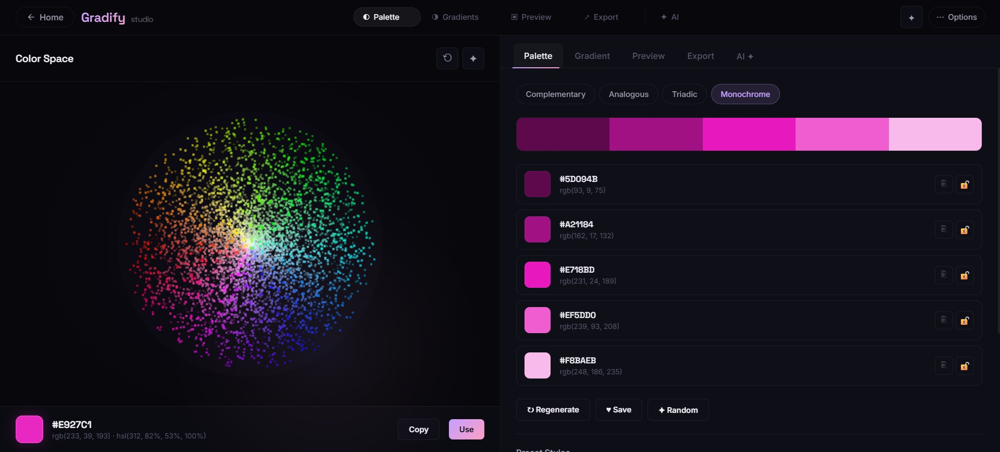

# Gradify

Gradify is a single-file interactive web app for exploring colors in 3D, generating palettes, crafting gradients, previewing UI styles, and exporting design tokens for real projects.

[](./demo/1.mp4)

Click the screenshot above to open the demo video, or use this direct link: [Watch Demo Video](./demo/1.mp4)

## Overview

Gradify combines a visual landing experience with a studio-style workspace for color experimentation. It is built as a lightweight front-end project with everything inside a single `index.html`, making it easy to run, share, and deploy.

## Features

- 3D color space explorer for picking and applying a base color
- Palette generation with complementary, analogous, triadic, and monochrome modes
- Gradient builder with linear, radial, and conic gradients
- Live preview panel for checking colors in dark and light UI states
- Export tools for CSS variables, Tailwind config snippets, HEX values, and JSON downloads
- AI-inspired palette generation using prompt keywords
- Saved palettes with browser `localStorage`
- Smooth animated landing page and studio transitions

## Demo

### Screenshot


### Video

- Demo video file: [demo/1.mp4](./demo/1.mp4)
- Screenshot file: [demo/2.jpg](./demo/2.jpg)

## Tech Stack

- HTML5
- CSS3
- Vanilla JavaScript
- [Three.js](https://threejs.org/) for 3D visuals
- [Chroma.js](https://gka.github.io/chroma.js/) for color generation and manipulation

## Project Structure

```text
gradify/
|-- demo/
|   |-- 1.mp4
|   `-- 2.jpg
|-- index.html
|-- README.md
`-- .gitignore
```

## Getting Started

Because this is a static project, you can run it in a few simple ways:

### Option 1: Open directly

Open `index.html` in your browser.

### Option 2: Use a local server

If you want a cleaner development workflow, serve the folder locally:

```powershell
cd E:\project\gradify
python -m http.server 5500
```

Then open `http://localhost:5500`.

## How To Use

1. Launch the studio from the landing page.
2. Pick a base color from the 3D color sphere.
3. Generate a palette or switch between palette modes.
4. Build and adjust gradients from the Gradient tab.
5. Preview colors in sample UI blocks.
6. Copy code snippets or download palette JSON from the Export tab.
7. Try prompt-based palette ideas in the AI tab.

## Keyboard Shortcuts

- `Space` to generate random inspiration
- `G` to jump to the gradient tab
- `1` to `5` to copy a palette color
- `Esc` to close menus or exit the app view

## GitHub Ready Notes

- The README includes both demo assets from the `demo` folder.
- GitHub will show the image inline and keep the video as a clickable file link.
- Since the app is static, it can be deployed easily on GitHub Pages, Vercel, Netlify, or any static hosting platform.

## Suggested Repository Description

Interactive 3D color palette and gradient studio built with HTML, CSS, JavaScript, Three.js, and Chroma.js.

## License

You can add your preferred license here before publishing.
